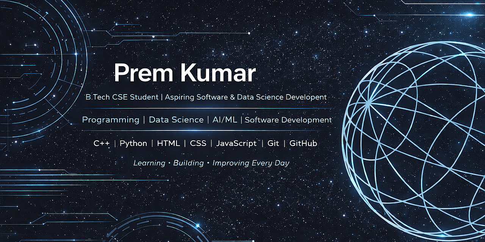

  

# Hi, I'm Prem Kumar 👋

🎓 B.Tech CSE Student at DY Patil International University  
💻 Learning C++, Python, HTML, CSS, JavaScript, AI & Data Science  
🚀 Interested in Tech Innovations, Projects & Problem Solving  

---

## 🛠️ Skills (Beginner Level)
- C++
- Python
- HTML
- CSS
- JavaScript
- Data Science (Learning)

---

## 📚 Currently Learning
- Machine Learning Basics  
- Python for Data Science  
- Web Development Fundamentals  
- Git & GitHub  

---

## 🎯 Goals
- Build strong programming fundamentals  
- Create real-world projects  
- Improve problem solving skills  
- Explore AI & Machine Learning
